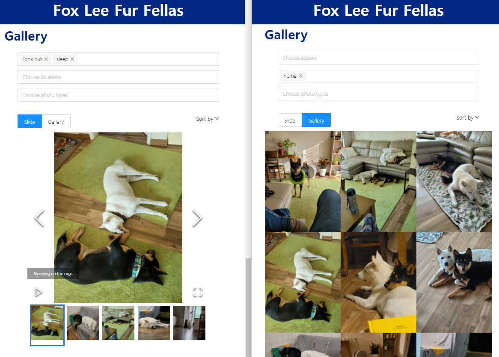
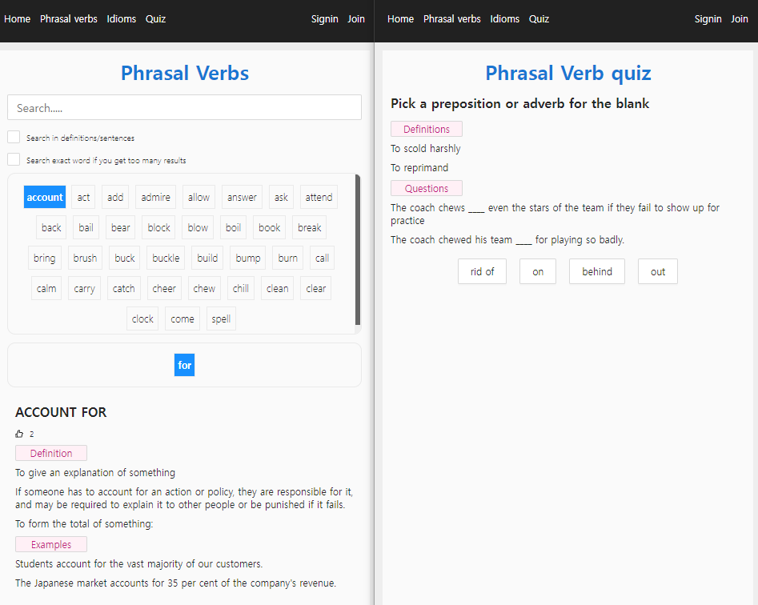

# Hello, folks!
## Projects
### 1. [Furfellas](http://furfellas.foxlee.kr/)

* [Project introduction page and Front repository(NextJs, S3)](https://github.com/daehan0226/furfellas)
* [Back repository(Flask, MongoDB, Docker, EC2)](https://github.com/daehan0226/furfellas_server)
### 2. [Learn English Phrasal verbs and idioms](http://english.foxlee.kr/)

* [Project introduction page and Front repository(NextJs, S3)](https://github.com/daehan0226/learn-english)
* [Back repository(Flask, Mysql, Docker, EC2)](https://github.com/daehan0226/learn-english-server)
* [Crawler repository](https://github.com/daehan0226/learn-english-crawler)
## 공부했던, 고민했던, 적용했던 주제들...
### API Design
1. [RESTful API란?](https://foxlee.tistory.com/18)
2. [RESPONSE STATUS CODE, 객체 활용 응답 처리(데코레이터, 클래스)](https://foxlee.tistory.com/85)

### TDD
1. [테스트를 시작하게 된 계기](https://foxlee.tistory.com/82)
2. [테스트 코드 작성하기](https://foxlee.tistory.com/83)

### DB
1. [Raw SQL -> ORM 으로 변경하자](https://foxlee.tistory.com/84)
2. 관계형 VS 문서형 

### Refactoring
* [객제지향프로그래밍으로 코드도 줄이고 가독성을 향상시켜보자 - 크롤러 개발](https://foxlee.tistory.com/79)

### Network
* [네트워크 기본 개념](https://foxlee.tistory.com/50)
* [DNS](https://foxlee.tistory.com/25)
* [TCP/IP](https://foxlee.tistory.com/51)
* [사용자 인증 Cookie, Session, JWT](https://foxlee.tistory.com/27)
